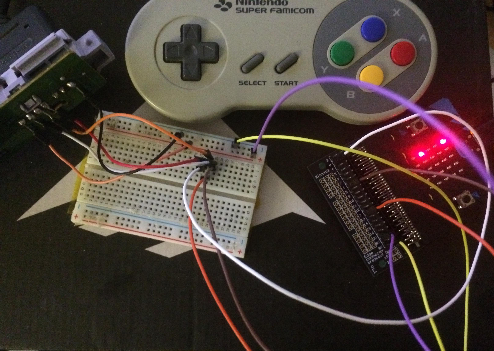

# Challenge 1 for Internet of Things - UFCFVK-15-2 2019
## How To Build

This Challenge was developed for the BBC micro:bit board

Its simple tetris! Whats not to love :)

To Build:
    
    1.
        yt target bbc-microbit-classic-gcc
    
    2.
        yt build
    
    3.
        copy the hex file in ./build/bbc-microbit-classic-gcc/source/
        to the mounted MICROBIT storage device and enjoy!
        
        *use teris-combined.hex
    
## How To Play

1.
    To start the game, when the screen displays TETRIS!
    simply hold down the Start button on the SNES pad or if using
    default controls press both A/B at the same time and hold them
    till game starts.

2.
    Left/Right by default are A/B but on the SNES pad it is <-/-> on the dpad.
    
    To rotate a brick, use A/B at the same time, rotation with default controls
    is unidirectional, where as with SNES controls, B is counter clockwise where
    as A is clockwise rotation.
    
    SNES controls also allows for moving the bricks faster to the bottom via
    Down on the dpad.
    
    Make sure you repress the button every time since controls are not tuned
    for continual button press input.
    
3.
    At the game over screen via SNES hold start to reset the game after the
    score appears or with default cotnrols hold B.

## BONUS!
    
This version of tetris for the microbit supports
a Super Nintendo/Super Famicom controller with the help of an edge
connector like seen here..
    
https://www.kitronik.co.uk/5601b-edge-connector-breakout-board-for-bbc-microbit-pre-built.html

To enable SNES controller support, simple uncomment line 12 in tetris.cpp

`#define SNES`

and connect the following pins from the controller

    0 - 3V3
    1 - Clock
    2 - Latch
    3 - Data
    6 - GND

a better detailed guide on how do do so can be seen here..
http://www.multiwingspan.co.uk/micro.php?page=snes

This project uses the same pin layout as explained there, 
with pins: 

    2 = latch
    
    1 = clock
    
    0 = data

and 3.3v/GND of the micro:bit wired accordingly.

