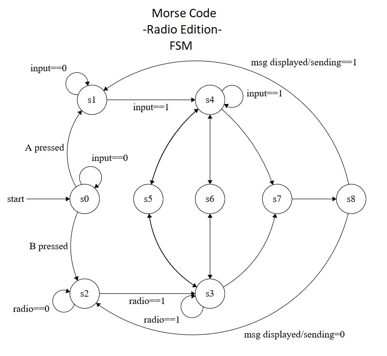

# Challenge 3 for Internet of Things - UFCFVK-15-2 2019

This Challenge was developed for the BBC micro:bit board

-RADIO EDITION-

Morse code handling over radio with Ceasar Cipher support!

To Build:
    
    1.
        yt target bbc-microbit-classic-gcc
    
    2.
        yt build
    
    3.
        copy the hex file in ./build/bbc-microbit-classic-gcc/source/
        to the mounted MICROBIT storage device and enjoy!
        
        *use morse-radio-combined.hex

## Usage

On Start:

		Enter A for sending
		Enter B for receiving

Enter Rotation:

		A to increase from 0
		B to confirm

Communication:

		Press A quickly for Dih
		Press and hold A for 1 second for Dah
		Press and hold A for 2 seconds for Stop

### Morse Code Sending/Recievng

	S0 = Start, input is 0 so stays here, 
		 	else if button B is pressed -> S2
			else if button A is pressed -> S1 
	

	S1 = Button A is not pressed so stays here, 
		 	Button A is pressed -> S4

	S2 = Radio signal datagram event not triggered so stays here, datagram detected -> S3

	S3 = While datagram is being processed stay, else when done, 
		 	data is "." -> S5
			data is "-" -> S6
			data is "!" -> S7

	S4 = While button A is pressed stay here, 
		 	else when it was pressed for >230ms and <470ms -> S5
		 	else when it was pressed for >470ms and <1000ms -> S6
		 	else when it was pressed for >1000ms -> S7

	S5 = push morse to message buffer and 
		 	if send mode==true -> S4
			if send mode==false -> S3

	
	S6 = push morse to message buffer and 
			if send mode==true -> S4
			if send mode==false -> S3

	S7 = process the buffered message -> S8

	
	S8 = Display message and 
			if send mode==true -> S1
			if send mode==false -> S2

## Encryption

This morse code decoder/encoder makes use of a ceasar cipher 
for an alphanum range of 
    
    ABCDEFGHIGKLMNOPQRSTUVWXYZ0123456789

Upon starting the device, the user must input the agreed upon rotation in
order to decode the morse code traffic 

The traffic will be in an encoded state and upon receiving the stop signal on the 
receivers side the message will be decoded and rotatated to display 
the correct message.

