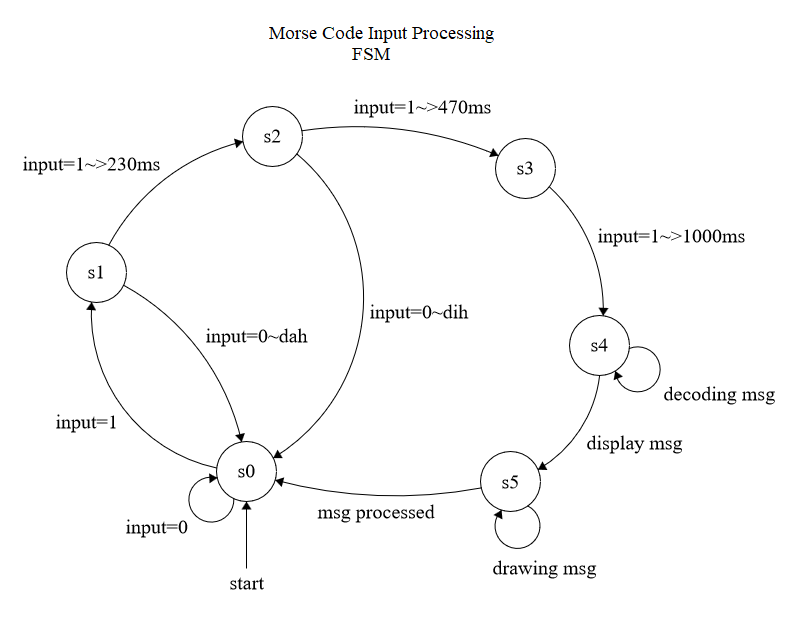

# Challenge 2 for Internet of Things - UFCFVK-15-2 2019
## How To Build

This Challenge was developed for the BBC micro:bit board

Morse code bidirectional handling with Ceasar Cipher support!

To Build:
    
    1.
        yt target bbc-microbit-classic-gcc
    
    2.
        yt build
    
    3.
        copy the hex file in ./build/bbc-microbit-classic-gcc/source/
        to the mounted MICROBIT storage device and enjoy!
        
        *use morse-combined.hex

## Finite State Machines

### Morse Code Input Handling

	
    s0 = no input detected
    s1 = input detected
    s2 = input is high for longer than 230ms so considered a DIH
    s3 = input is high for longer than 470ms so considered a DAH instead
    s4 = input is high for longer than 1000ms so considered a STOP instead, starts decoding message
    s5 = process decoded message and display, return to s0 after done displaying
    
### Morse Code Sending/Recievng

    S0 = start, input is 0 stay here, else if input is high then process morse signal to buffer, 
         if stop is seen on signal then move to s2
    S1 = while input is high check if it is dot/dash/stop based on how long
         it is held, when released, move to s0 
    S2 = decode msg and display it, if we are sending(user input msg instead of input from wire)
         move to s3, else move to s0 only displaying the msg
    S3 = encode the msg, send the message, and return to s0

## Encryption

This morse code decoder/encoder makes use of a ceasar cipher 
for an alphanum range of 
    
    ABCDEFGHIGKLMNOPQRSTUVWXYZ0123456789

Upon starting the device, the user must input the agreed upon rotation in
order to decode the morse code traffic 

The traffic will be in an encoded state and upon receiving the stop signal on the 
receivers side the message will be decoded and rotatated to display 
the correct message.

